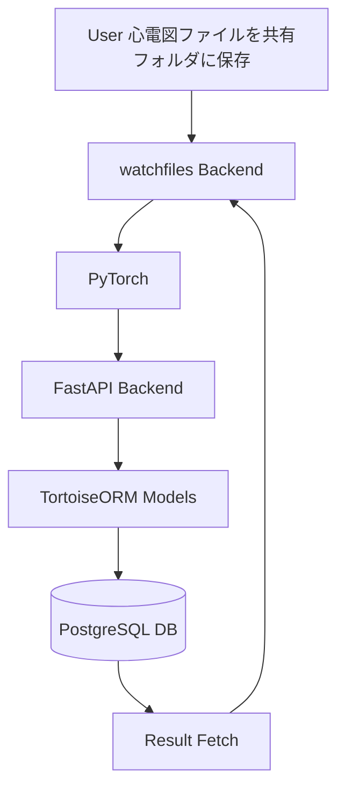

# Technical Architecture: Electrocardiogram Viewer

## 1. System Overview

Swing Insight は、ゴルファーのスイングを動画から自動解析し、姿勢データ・動作フェーズ・スコアリングを統合的に評価するアプリケーションである。
AI姿勢推定（Mediapipe）と動作解析（Python FastAPI + Streamlit）を中心に構築され、ローカル環境で軽量かつ再現性の高いスイング分析を実現する。

## 2. Architecture Overview

アーキテクチャ構成：

- **Frontend (UI)**: React — 結果の可視化・操作インターフェイス
- **Backend (API)**: FastAPI — 検査ごとの心電図データ・推論結果の検索、出力
- **Backend (Service)**: watchfiles - 心電図データファイル新規追加監視・推論パイプライン実行
- **Database**: PostgreSQL — 心電図データ・推論結果履歴管理
- **AI Engine**: PyTorch — 心臓発作リスク推論モデル
- **ORM**: TortoiseORM — 非同期ORMによるDB抽象化

アプリ構成はモジュラー設計であり、将来的にクラウドデプロイ（AWS Lambda, GCP Cloud Run）への移行を想定している。

## 3. Architecture Diagram

## 4. Technology Stack

|Layer|Technology|Purpose|Notes|
|---|---|---|---|
|UI|React|分析結果の表示と動画操作|軽量・Python統合性が高い|
|Backend API|FastAPI|非同期API|CORS設定済み|
|Backend Service|watchfiles|ファイル監視・推論実行||
|ORM|TortoiseORM|DBモデル定義・非同期I/O|PostgreSQLドライバ使用|
|DB|PostgreSQL 15|結果・メタ情報管理||
|ML Engine|PyTorch|心電図から心臓発作リスク推論|CPU推論前提|

## 5. Data Flow

1. ユーザーが心電図ファイルを共有フォルダに保存
2. watchfilesがファイルの追加を監視し、ファイルが追加されたら推論処理を実行
3. 推論処理でPyTorchが心臓発作リスクを評価
4. 結果を PostgreSQL に永続化
5. React UIがFastAPIに心電図データ、心臓発作リスク評価結果を取得
6. React UI が心電図データをグラフ・心臓発作リスク評価結果で結果を表示

## 6. Database Schema

TBD

## 7. Module Design

|Module|Role|Main Classes / Functions|
|---|---|---|
|service/heart_attack_inferrer.py|心電図心臓発作リスク評価|HeartAttackInferrer, infer()|
|db/models.py|ORMモデル|Examination, Electrocardiogram, InferenceResult|
|db/enums.py|値オブジェクト|TBD|
|repository/examination.py|検査リポジトリ|TBD|
|repository/electrocardiogram.py|心電図リポジトリ|TBD|
|repository/inference_result.py|推論結果リポジトリ|TBD|
|domain/examination.py|検査ドメイン|TBD|
|usecase/examination.py|検査ユースケース|TBD|
|controller/examination.py|FastAPIエンドポイント|/examination, /subject|
|ui/main.ts|React UI|TBD|

## 8. Non-Functional Requirements

|項目|目標値|根拠・補足|
|---|---|---|
|推論処理時間|≤5分|MFERファイル・CPU推論時|
|メモリ使用量|≤1GB|ローカル実行を想定|
|データ保存|永続（PostgreSQL）|MFERファイルごとに1診断として保存|
|再現性|完全再現可|モデルバージョン・シード固定|

## 9. Testing Policy

- Unit Tests: pytest + sqlite（Tortoise Test DB）
- Integration Tests: FastAPI TestClient でエンドポイント確認

## 10. CI/CD

- GitHub Actions による自動テスト
- PR時に pytest 実行 + 型チェック（pyright） + フォーマットチェック（ruff）
- バージョニング：v{major}.{minor}.{patch}
- AIモデル更新時：MODEL_VERSION をDBに格納

## 11. Security & Privacy

- 動画データはローカル保存（クラウド転送禁止）
- ユーザー識別は匿名化ID方式
- HTTPS通信を前提とする
- MFERデータからデータを読み込み時は匿名加工を実施し、DBに個人情報は保存しない。またログに出力することもしない。

## 12. Future Roadmap

|フェーズ|拡張内容|予定時期|
|---|---|---|
| Phase 1 | 新規心電図ファイル検出、心臓発作リスク評価、心臓状態表示 | 〜2025/11 |
| Phase 2 | 被験者検索、検査データ検索 | 〜2026/1 |

## 13. Appendix

### 使用ライブラリ一覧

- fastapi
- tortoise-orm
- psycopg[binary]
- pytorch

### 開発環境情報

|項目|値|Note|
|--|--|--|
|OS|macOS Tahoe|26.0.1|
|Python|3.14|PyTorchのバージョンに合わせる|
|DB|PostgreSQL 15||
|Editor|VSCode + Spec-Workflow MCP||
|Container|Docker Compose（dev）||

### メンテナンスポリシー

- モデル・データスキーマはSemVer互換
- スイング解析ロジック変更時は design.md に反映
- API契約変更は openapi.yaml を更新
